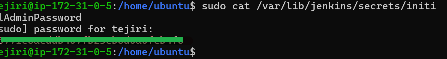
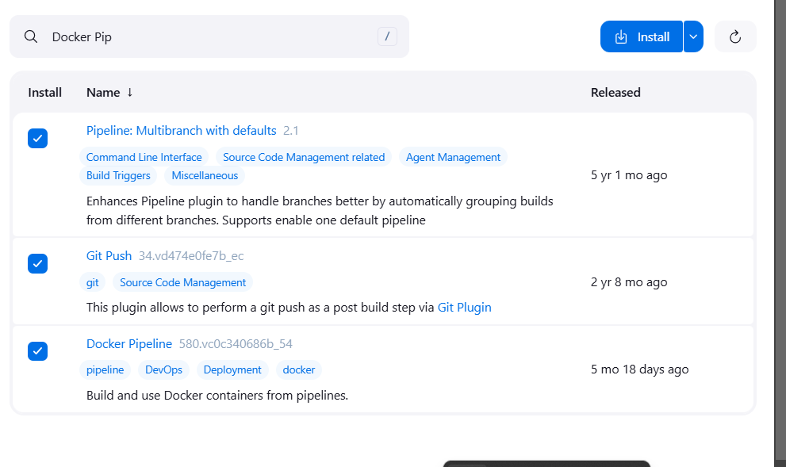
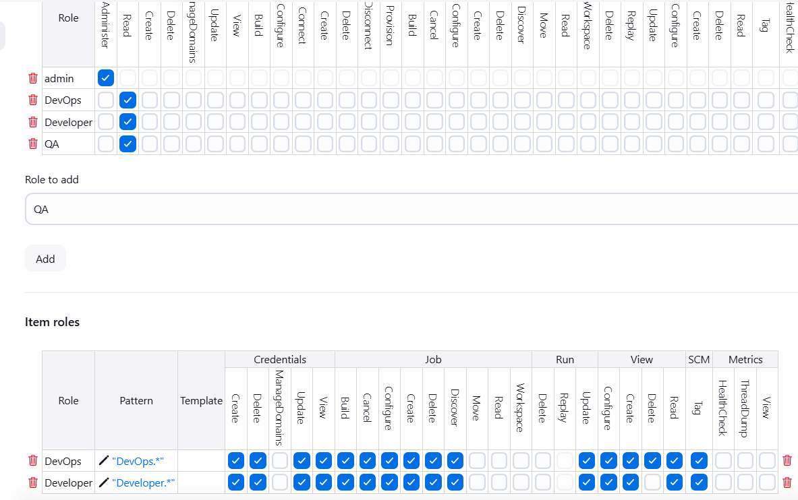
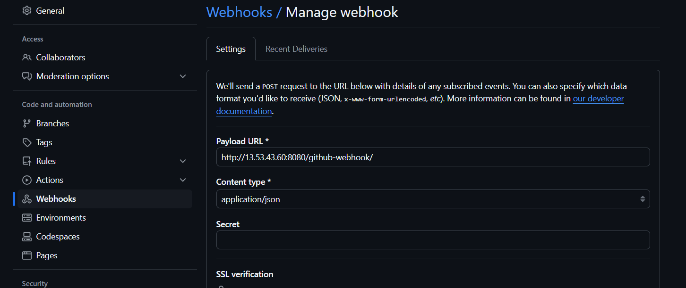
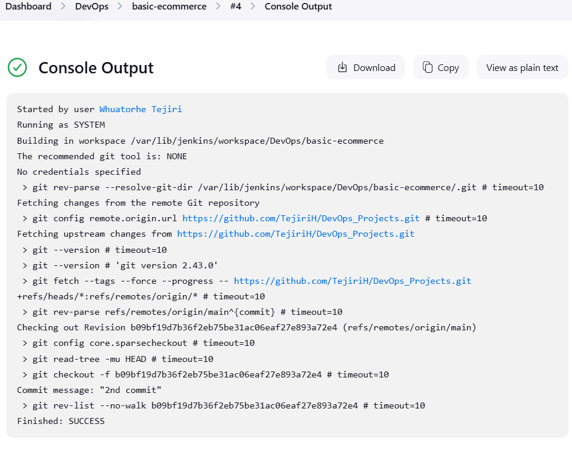
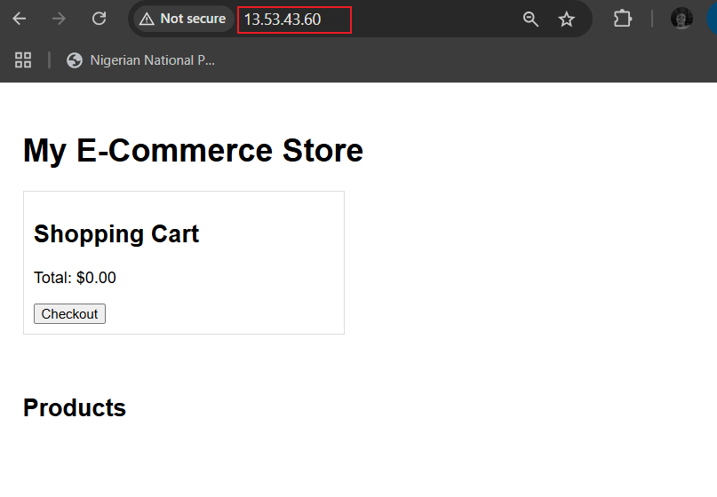
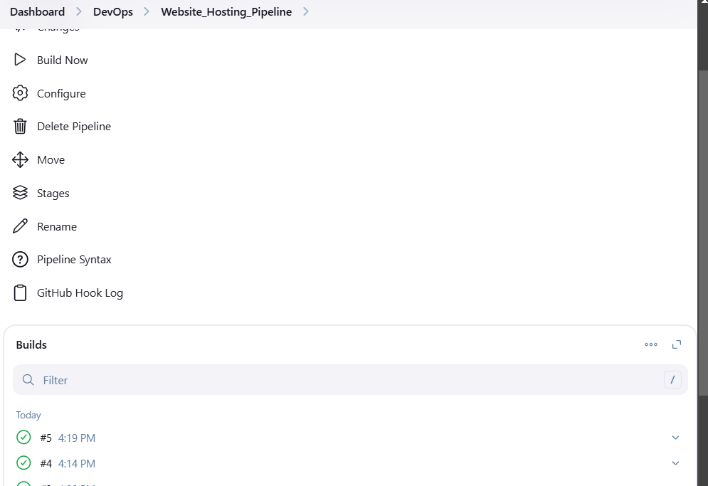
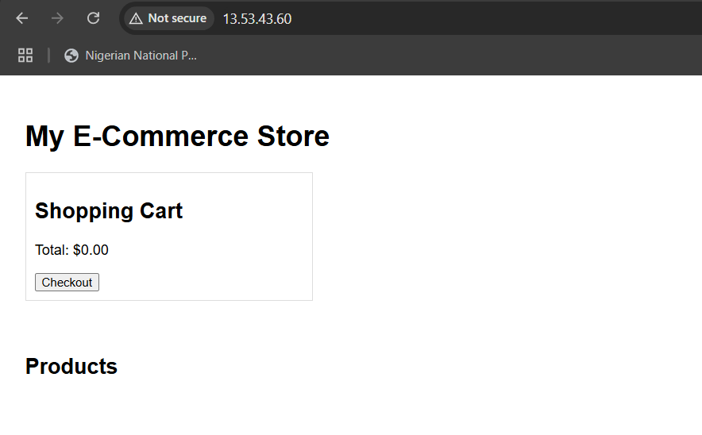

# Automating Basic E-Commerce Website Deployment Using Docker container with Jenkins

This guide outlines the steps to automate the deployment of an eCommerce website using Docker containers and Jenkins. By leveraging a CI/CD pipeline, we can automate the building, testing, and deployment processes.

## Prerequisites
- **Jenkins Server**: A Jenkins server installed and configured (either locally or in the cloud).
- **Docker**: Docker installed and configured to build and run containers.
- **GitHub Repository**: A GitHub repository to store the source code for the eCommerce website.
- **Docker Hub Account**: A Docker Hub account for storing built Docker images.


## Steps to Automate E-Commerce Deployment

### 1. **Install and Configure Jenkins**
   - I wrote a script to Install Jenkins on an ubuntu server and granted the permission to the script.

   script

```bash
 #! /bin/bash

#Script to Automate the installation process of jenkins


sudo apt update -y
yes | sudo apt upgrade


 yes | sudo apt install openjdk-17-jdk
java -version
#Import the Jenkins key

curl -fsSL https://pkg.jenkins.io/debian/jenkins.io.key | sudo tee \
/usr/share/keyrings/jenkins-keyring.asc > /dev/null


wget -q -O - https://pkg.jenkins.io/debian/jenkins.io-2023.key | sudo gpg --dearmor -o /usr/share/keyrings/jenkins-keyring.gpg


#Add the Jenkins repository

echo "deb [signed-by=/usr/share/keyrings/jenkins-keyring.gpg] https://pkg.jenkins.io/debian binary/" | sudo tee /etc/apt/sources.list.d/jenkins.list > /dev/null


sudo apt update

yes | sudo apt install jenkins

sudo systemctl start jenkins
sudo systemctl enable jenkins
sudo cat /var/lib/jenkins/secrets/initialAdminPassword "
```

    
    sudo chmod 755 jenkins.sh
     

   - I added Jenkins to the Docker group to allow Jenkins to run Docker commands:


     ```bash
     sudo usermod -aG docker jenkins
     ```

### 2. **Install and Configure Docker**

   - I wrote a script to install docker using swap to add to the ram to make it sufficient as docker can't run on the 1gb free tier ec2 and named the script docker.sh

   ```
   #! /bin/bash

# Script to install Docker in aws free tier ubuntu

sudo apt update -y
sudo apt upgrade -y

sudo dd if=/dev/zero of=/swapfile bs=1M count=1024
sudo chmod 600 /swapfile

sudo mkswap /swapfile

sudo swapon /swapfile
sudo swapon --show
echo '/swapfile none swap sw 0 0' | sudo tee -a /etc/fstab
sudo apt install -y apt-transport-https ca-certificates curl software-properties-common
curl -fsSL https://download.docker.com/linux/ubuntu/gpg | sudo gpg --dearmor -o /usr/share/keyrings/docker-archive-keyring.gpg

echo "deb [arch=amd64 signed-by=/usr/share/keyrings/docker-archive-keyring.gpg] https://download.docker.com/linux/ubuntu $(lsb_release -cs) stable" | sudo tee /etc/apt/sources.list.d/docker.list > /dev/null

sudo apt update -y
sudo apt install -y docker-ce


sudo systemctl status docker
   ```

   - I granted the neccessary permission and executed the script.
   and docker was installed.

### 3. **Create a different user**

- I created a different user and granted permission to run Docker command to reduce unauthorized access from users using ubuntu user.


### 4. **Configure Jenkins security**
- I accessed jenkins using my server ip-address:8080 port and pasted the admin password copied from this path.



"sudo cat /var/lib/jenkins/secrets/initialAdminPassword "


   - I Installed the following Jenkins plugins:
     - **Docker Pipeline**: Enables Jenkins to interact with Docker.
     - **Git Plugin**: To pull code from GitHub repositories.
     - **Pipeline Plugin**: To create pipeline jobs in Jenkins.
     - **Role based access**:  To grant access to resource on a role bases.

     

     - I configured jenkins to use jenkins Database since we didn't have an active directory and disabled sign in as well to secure access to jenkins.
     - I created role folder to limit access to job and general jenkins settings.

     
     


### 5. **Set Up the GitHub Repository**
   - Create a Git repository for your eCommerce website and ensure it contains:
     - **Dockerfile**: Instructions for building the Docker image.
     script

```#Use the official Nginx image as a base
FROM nginx:latest

# Copy the website files to Nginx's HTML directory
COPY ./ecommerce-website/index.html /usr/share/nginx/html
COPY ./ecommerce-website/styles.css /usr/share/nginx/html

# Expose port 80 for the application
EXPOSE 80
```

     - **Website Files**: HTML, CSS, JS files, etc.
     - **.dockerignore**: To ignore unnecessary files during the Docker build.
     
     Create a git-hub repository without README file and leave git ignore unticked.

     - **Web-hook**: I went to settings and clicked webhook and then change the url to http://my-server-ip:8080/github-webhook

       

  

### 6. **Create Freestyle Project**

I opened the DevOps folder and created a Free style job to automate the deployment of a static website.

- I clicked on git under source code management and added my github url on repository url and assigned the branch as main on branch specifier.
- I also used sparse checkout paths and placed by subfolder name/* as my file path to be served.
- On triggers i clicked "GitHub hook trigger for GITScm polling"
- Under build steps i searched for Execute shell and wrote the below script

```
# Navigate to the directory containing the Dockerfile (optional if it's the workspace root)
cd /var/lib/jenkins/workspace/DevOps/basic-ecommerce/Basic_jenkins_automation/


# Build the Docker image with the name 'static-website'
docker build -t basic-ecom .

# Stop and remove any running containers from previous builds
docker ps -q --filter "name=static-website" | xargs -r docker stop | xargs -r docker rm

# Run the Docker container with the static website
docker run -d -p 80:80 --name static-website basic-ecom

```

After pushing the files to my github, it automatically builds and was successful, website worked





### 6. **Create Pipeline Project**

I opened the DevOps folder and new item and then clicked Pipeline and created it.

- Under the Build triggers i clicked the Github hook trigger for GITScm polling to activate the hookup to github and then under Pipeline script i pasted the script below

```
pipeline {
    agent any
    
    environment {
        DOCKER_IMAGE = 'nginx:latest' // Image to use for building the Docker container
        WEBSITE_DIR = 'Basic_jenkins_automation' // Directory containing website files
        DOCKERHUB_REPOSITORY = 'devops_repo' // Your Docker Hub repository name
        DOCKERHUB_CREDENTIALS = 'dockerhub-credentials' // The ID of the stored Jenkins credentials
    }
    
    stages {
        stage('Checkout') {
            steps {
                git url: 'https://github.com/TejiriH/DevOps_Projects.git', branch: 'main'
            }
        }
        
        stage('Build Docker Image') {
            steps {
                script {
                    // Build the Docker image
                    sh 'docker build -t my-website .'
                }
            }
        }
        
        stage('Run Docker Container') {
            steps {
                script {
                    // Stop and remove any previous containers
                    sh 'docker ps -a -q --filter "name=my-website-container" | xargs -I {} docker stop {}'
                    sh 'docker ps -a -q --filter "name=my-website-container" | xargs -I {} docker rm {}'
                    // Run the new container
                    sh 'docker run -d -p 80:80 --name my-website-container my-website'
                }
            }
        }

        stage('Push to Docker Hub') {
            steps {
                script {
                    // Log in to Docker Hub using Jenkins credentials
                    withCredentials([usernamePassword(credentialsId: DOCKERHUB_CREDENTIALS, usernameVariable: 'DOCKER_USERNAME', passwordVariable: 'DOCKER_PASSWORD')]) {
                        echo "DOCKER_USERNAME: ${DOCKER_USERNAME}"  // Debug: Print the username to verify it's being set
                        echo "DOCKER_PASSWORD: ${DOCKER_PASSWORD}"  // Debug: Print the password to verify it's being set

                        // Login to Docker Hub
                        sh 'echo $DOCKER_PASSWORD | docker login -u $DOCKER_USERNAME --password-stdin'

                        // Debug: Print out the repository details
                        echo "DOCKER_USERNAME: ${DOCKER_USERNAME}"
                        echo "DOCKERHUB_REPOSITORY: ${DOCKERHUB_REPOSITORY}"

                        // Tag the Docker image with the Docker Hub repository name
                        sh "docker tag my-website ${DOCKER_USERNAME}/${DOCKERHUB_REPOSITORY}:latest"
                        
                        // Push the image to Docker Hub
                        sh "docker push ${DOCKER_USERNAME}/${DOCKERHUB_REPOSITORY}:latest"
                    }
                }
            }
        }
        
        stage('Clean Up Docker') {
            steps {
                script {
                    // Clean up unused Docker images and containers
                    sh 'docker system prune -f'
                }
            }
        }
    }
    
    post {
        success {
            echo 'Build and deployment succeeded. The container is running on port 80, and the image is pushed to Docker Hub.'
        }
    }
}


```

- I saved and applied it and pushed the code to github and it automated the build and then the website was hosted




### 7. **Challenges**
We ran into several issues trying to conclude this project especially in debugging our scripts from the jenkins installation script to the pipeline deployment script but with consistent troubleshooting we were able to get it right.

### 7. **Conclusion**
Purpose of project was achieved, i achieved hands-on on working around jenkins and learnt important DevOps skill such as debugging. In the end project was successful.
