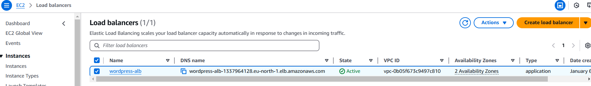

# Project Documentation: High-Availability WordPress Hosting on AWS

## Project Overview

This project demonstrates using Terraform scripts to hosting a high-availability WordPress site using an AWS infrastructure. The architecture includes a secure VPC setup, scalable web servers, a shared EFS for storage, an RDS MySQL database for WordPress, and an Application Load Balancer for traffic distribution.


### Key Features
1. **VPC with Public and Private Subnets:**
   - The VPC spans **3 Availability Zones** for high availability and fault tolerance.
   - It contains:
     - **2 Public Subnets** for NAT Gateways and load balancers.
     - **4 Private Subnets** for web servers, the MySQL database, and other backend resources.

2. **Internet Gateway and NAT Gateways:**
   - An **Internet Gateway** allows communication between instances in the public subnets and the internet.
   - **2 NAT Gateways** are configured in the public subnets, providing internet access for resources in private subnets.

3. **Routing Configuration:**
   - A **Public Route Table** routes traffic from public subnets to the internet.
   - **Two Private Route Tables** route traffic from private subnets to their respective NAT Gateways.

4. **Network Security:**
   - **Security Groups** are configured to allow specific traffic (e.g., HTTP, HTTPS, and MySQL) between components.
   - **Network ACLs (NACLs)** provide an additional layer of network security.

5. **Amazon RDS MySQL Database:**
   - A **MySQL database** is deployed in the private subnet for WordPress data storage.

6. **Amazon EFS:**
   - A **shared Elastic File System (EFS)** is used to enable file sharing between WordPress web servers across Availability Zones.

7. **Web Servers:**
   - Two **EC2 instances** act as WordPress web servers, deployed in private subnets across two Availability Zones for redundancy.

8. **Application Load Balancer (ALB):**
   - An **Application Load Balancer** distributes incoming traffic to web servers in the target group.

9. **Auto Scaling Group:**
   - The Auto Scaling Group dynamically manages EC2 instances based on load, ensuring high availability.

10. **Route 53:**
    - **Amazon Route 53** is used for DNS management to register the domain and create a record set pointing to the ALB.

---

## Detailed Architecture Components

### 1. **VPC**
   - CIDR Block: `10.0.0.0/16`
   - Subnets:
     - **2 Public Subnets** (e.g., `10.0.1.0/24`, `10.0.2.0/24`)
     - **4 Private Subnets** (e.g., `10.0.3.0/24`, `10.0.4.0/24`, `10.0.5.0/24`, `10.0.6.0/24`)
   - Availability Zones: **3**

### 2. **NAT Gateways and Route Tables**
   - **NAT Gateways**:
     - NAT Gateway 1 in Public Subnet 1 (AZ-1)
     - NAT Gateway 2 in Public Subnet 2 (AZ-2)
   - **Route Tables**:
     - Public Route Table: Routes `0.0.0.0/0` to the Internet Gateway.
     - Private Route Tables: Routes `0.0.0.0/0` to their respective NAT Gateways.

### 3. **Network Security**
   - **Security Groups**:
     - Web Server SG: Allows HTTP (80) and HTTPS (443) traffic from the ALB.
     - Database SG: Allows MySQL (3306) traffic from the Web Server SG.
   - **NACLs**:
     - Configured for ingress and egress traffic control.

### 4. **Amazon RDS MySQL Database**
   - Engine: MySQL 8.0
   - Instance Class: `db.t3.micro`
   - Storage: 20GB (Free Tier)
   - Subnet Group: Spans private subnets for high availability.

### 5. **Amazon EFS**
   - EFS is configured with lifecycle policies to transition files to Infrequent Access after 30 days.
   - Mount targets are created in each private subnet.

### 6. **EC2 Instances for WordPress**
   - **Launch Template**:
     - Configures EC2 instances with WordPress software and EFS mounts.
     - Uses a custom AMI with pre-installed WordPress files.
   - **Auto Scaling Group**:
     - Ensures at least 2 EC2 instances are always running.
     - Scales up or down based on CPU utilization.

### 7. **Application Load Balancer**
   - Distributes incoming HTTP/HTTPS traffic to the web server instances in the Auto Scaling Group.
   - Health checks ensure only healthy instances receive traffic.

### 8. **Route 53**
   - Configured to route traffic to the ALB via a domain name.

---

## Deployment Workflow

1. **VPC Creation:**
   - Deploy the VPC with subnets, Internet Gateway, NAT Gateways, and route tables, and output the subnets ids, security groups id, vpc id for use while creating other resources
```hcl
" resource "aws_vpc" "main" {
  cidr_block = var.vpc_cidr_block
  enable_dns_support = true
  enable_dns_hostnames = true
  tags = {
    Name = "wordpress-vpc"
  }
}

data "aws_availability_zones" "available" {
  state = "available"
}


resource "aws_subnet" "public" {
  count = length(var.public_subnet_cidrs)
  vpc_id = var.vpc_id
  cidr_block = var.public_subnet_cidrs[count.index]
  map_public_ip_on_launch = true
  availability_zone = data.aws_availability_zones.available.names[count.index % length(data.aws_availability_zones.available.names)]
  tags = {
    Name = "Public-Subnet-${count.index + 1}"
  }
} 

output "vpc_id" {
  value = aws_vpc.main.id
}

output "public_subnet_ids" {
  value = aws_subnet.public[*].id
}

output "private_subnet_ids" {
  value = aws_subnet.private[*].id
}
```

2. **Database Deployment:**
   - Create an RDS MySQL instance in the private subnet.
   - Output the database endpoint for use in the WordPress configuration.


```hcl
 resource "aws_db_instance" "mysql" {
  allocated_storage    = 20                
  max_allocated_storage = 20               
  engine               = "mysql"
  engine_version       = "8.0"   
  instance_class       = "db.t3.micro"                      
  username             = var.database_user             
  password             = var.database_pwd          
  parameter_group_name = "default.mysql8.0"      
  db_subnet_group_name = aws_db_subnet_group.mysql.name
  vpc_security_group_ids = [var.security_group_id] # Security group

  skip_final_snapshot = true               

  tags = {
    Name = var.database_name
  }
}
resource "aws_db_subnet_group" "mysql" {
  name       = "mysql-subnet-group"
  subnet_ids = var.private_subnet_ids

  tags = {
    Name = "MySQL-Subnet-Group"
  }
}
```

3. **EFS Setup:**
   - Deploy an Elastic File System with mount targets in private subnets for shared storage purposes.
   - Output the NFS link for EC2 instances to mount.

```hcl
# Create the EFS file system
resource "aws_efs_file_system" "example" {
  creation_token = "wordpress-efs"
  performance_mode = "generalPurpose"
}

resource "aws_efs_mount_target" "example" {
  count = length(var.first_3_subnets)

  file_system_id = aws_efs_file_system.example.id
  subnet_id      = var.first_3_subnets[count.index]
  security_groups = [var.private_security_id]  # Replace with your security group ID
}
```
4. **Web Server Deployment, ALB and DNS Configuation:**
   - Create two duplicate instance in two availability zones accross two subnets and configure them to host the wordpress site and use them as target group.
   - Mount EFS to `/var/www/html` for shared storage of WordPress files.
   - Configure the Application Load Balancer to distribute traffic to the web servers.
   - Use Route 53 to create a DNS record pointing to the ALB.
   - Use the Launch Template and Auto Scaling Group to deploy WordPress web servers in private subnets.



---

## Outputs
- **Database Endpoint:** URL of the RDS MySQL database.
- **EFS NFS Link:** NFS endpoint for shared storage.
- **Load Balancer DNS Name:** URL to access the WordPress site.

---

## Challenges

There were several challenges which had to do with debugging at every resources, but we were able to get passed them and in the area of security, we made use of AWS parameter store which is free and not paid for unlike AWS Secrets to ensure security of our database username and password which should not be hard coded.


## Conclusion

This architecture provides a scalable, fault-tolerant, and secure solution for hosting a WordPress site on AWS. By leveraging services like Auto Scaling, EFS, and RDS, it ensures high availability and performance across multiple Availability Zones.


