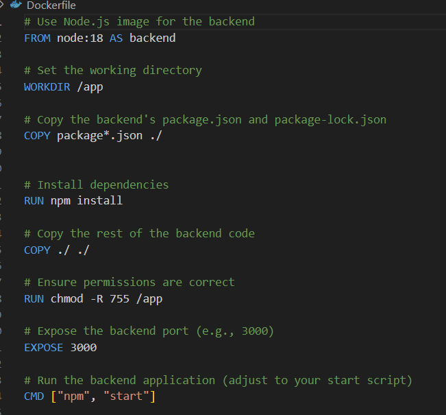
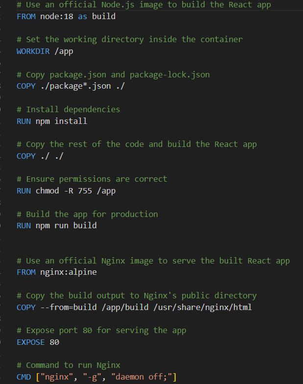
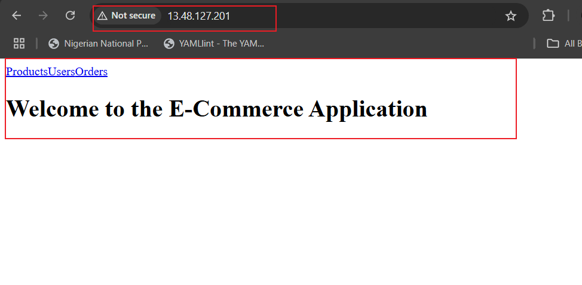

# Automate the Deployment of E-Commerce Website with GitHub Actions

This guide details how to create a CI/CD workflow to test, build, and deploy an e-commerce application on an EC2 instance using Docker containerization.

The application includes:
- A **backend** directory hosting a simple Node.js/Express application called "api."
- A **frontend** directory using React to interact with the backend API.

---

## Step 1: Prepare the Application

1. Ensure your application is ready, with Jest tests configured in the `package.json` file and all dependencies listed.
2. Test the application locally:
   - Run the Jest tests.
   - Build the application successfully.
3. Push the application code to the GitHub repository.

---

## Step 2: Create the Workflow Script

1. Write a GitHub Actions workflow file (`.github/workflows/ci-cd.yml`) at the root of the repository.
2. Configure the workflow to trigger:
   - On any push to the `main` branch.
   - On any pull request to the `main` branch.

### Workflow Jobs:
#### **Job 1: Test and Build**
- Test the application in multiple Node.js versions using a matrix strategy.
- Install `npm` and configure permissions to run Jest tests.
- Run Jest tests for both:
  - The backend (API directory).
  - The frontend (webapp directory).
- Build the frontend application and grant the necessary permissions.

---

## Step 3: Prepare the Dockerfiles

- **Backend Dockerfile**:
  - Use Node.js 18.
  - Copy the package files.
  - Run `npm install`.
  - Expose the backend's port.
  - Start the backend application.



- **Frontend Dockerfile**:
  - Similar setup to the backend.
  - Include an additional NGINX image to serve the frontend.
  - Copy the build output to the NGINX public directory.



---

## Step 4: Push Docker Images to Docker Hub

1. Update the GitHub repository secrets with:
   - Docker Hub username (`DOCKER_USERNAME`).
   - Docker Hub password (`DOCKER_PASSWORD`).

2. Add workflow steps to:
   - **Checkout the repository**:
     ```yaml
     - name: Checkout repository
       uses: actions/checkout@v2
     ```
   - **Log in to Docker Hub**:
     ```yaml
     - name: Log in to Docker Hub
       uses: docker/login-action@v2
       with:
         username: ${{ secrets.DOCKER_USERNAME }}
         password: ${{ secrets.DOCKER_PASSWORD }}
     ```
   - **Build and push Docker images**:
     ```yaml
     - name: Build Backend Docker image
       run: docker build -t ${{ secrets.DOCKER_USERNAME }}/my-backend:v1.0.0 ./ecommerce/api

     - name: Push Backend Docker image
       run: docker push ${{ secrets.DOCKER_USERNAME }}/my-backend:v1.0.0

     - name: Build Frontend Docker image
       run: docker build -t ${{ secrets.DOCKER_USERNAME }}/my-frontend:v1.0.1 ./ecommerce/webapp

     - name: Push Frontend Docker image
       run: docker push ${{ secrets.DOCKER_USERNAME }}/my-frontend:v1.0.1
     ```

---

## Step 5: Deploy to AWS

1. Update the GitHub repository secrets with:
   - AWS host IP (`AWS_HOST`).
   - AWS username (`AWS_USER`).
   - AWS EC2 private key (`AWS_EC2_PRIVATE_KEY`).

2. Add workflow steps to deploy the application:
   ```yaml
   - name: Deploy to EC2 via SSH
     uses: appleboy/ssh-action@v0.1.5
     with:
       host: ${{ secrets.AWS_HOST }}
       username: ${{ secrets.AWS_USER }}
       key: ${{ secrets.AWS_EC2_PRIVATE_KEY }}
       port: 22
       script: |
         # Stop and remove any existing containers
         docker rm -f backend frontend || true

         # Pull and run the backend container
         docker pull ${{ secrets.DOCKER_USERNAME }}/my-backend:v1.0.0
         docker run -d -p 5000:5000 --name backend ${{ secrets.DOCKER_USERNAME }}/my-backend:v1.0.0

         # Pull and run the frontend container
         docker pull ${{ secrets.DOCKER_USERNAME }}/my-frontend:v1.0.1
         docker run -d -p 80:80 --name frontend ${{ secrets.DOCKER_USERNAME }}/my-frontend:v1.0.1




# GitHub Actions Workflow Script for E-Commerce Platform

This workflow automates the build, test, and deployment of an e-commerce platform application to an EC2 instance using Docker.

---

## Workflow Script

```yaml
name: E-Commerce Platform App CI

on:
  push:
    branches:
      - main
    paths:
      - 'ecommerce-platform/**'  # Trigger on push to any file inside the ecommerce folder

  pull_request:
    branches:
      - main
    paths:
      - 'ecommerce-platform/**'  # Trigger on pull requests affecting the ecommerce folder

jobs:
  build-and-test:
    runs-on: ubuntu-latest
    permissions:
      contents: read   # Read access (if needed for deployment)

    strategy:
      matrix:
        node-version: [18.x]  # Testing with multiple Node versions

    steps:
      # Step 1: Check out the code
      - name: Checkout repository
        uses: actions/checkout@v2

      # Step 2: Set up Node.js
      - name: Set up Node.js
        uses: actions/setup-node@v2
        with:
          node-version: ${{ matrix.node-version }}

      # Step 3: Install dependencies for the API and Webapp
      - name: Install API dependencies
        working-directory: ./ecommerce/api
        run: npm install

      - name: Install Webapp dependencies
        working-directory: ./ecommerce/webapp
        run: npm install

      - name: Fix permissions for Jest executable
        run: |
          chmod +x ./ecommerce/api/node_modules/.bin/jest
          chmod +x ./ecommerce/webapp/node_modules/.bin/jest

      # Step 4: Run Jest tests for the API
      - name: Run Jest tests for API
        working-directory: ./ecommerce/api
        run: |
          npm install --save-dev supertest
          npm ci --include=dev
          npm test -- --coverage --maxWorkers=2

      # Step 5: Run Jest tests for the Webapp
      - name: Run Jest tests for Webapp
        working-directory: ./ecommerce/webapp
        run: |
          npm install --save-dev supertest
          npm test -- --coverage --maxWorkers=2

      # Step 6: Build the Webapp (optional, depending on your setup)
      - name: Build Webapp
        working-directory: ./ecommerce/webapp
        run: |
          chmod +x ./node_modules/.bin/react-scripts
          npm run build

  Create-dockerfile-image:
    runs-on: ubuntu-latest
    needs: build-and-test
    permissions:
      contents: read  # Read access for code checkout
      actions: write  # Write access for actions (needed for deployment)

    steps:
      # Step 1: Check out the code
      - name: Checkout repository
        uses: actions/checkout@v2

      # Step 2: Log in to Docker Hub
      - name: Log in to Docker Hub
        uses: docker/login-action@v2
        with:
          username: ${{ secrets.DOCKER_USERNAME }}
          password: ${{ secrets.DOCKER_PASSWORD }}

      # Step 3: Build Docker images
      - name: Build Backend Docker image
        run: docker build -t ${{ secrets.DOCKER_USERNAME }}/my-backend:v1.0.0 ./ecommerce/api

      - name: Build Frontend Docker image
        run: docker build -t ${{ secrets.DOCKER_USERNAME }}/my-frontend:v1.0.1 ./ecommerce/webapp

      # Step 4: Push Docker images to Docker Hub
      - name: Push Backend Docker image
        run: docker push ${{ secrets.DOCKER_USERNAME }}/my-backend:v1.0.0

      - name: Push Frontend Docker image
        run: docker push ${{ secrets.DOCKER_USERNAME }}/my-frontend:v1.0.1

      # Step 5: Deploy to EC2 via SSH
      - name: Deploy to EC2 via SSH
        uses: appleboy/ssh-action@v0.1.5
        with:
          host: ${{ secrets.AWS_HOST }}
          username: ${{ secrets.AWS_USER }}
          key: ${{ secrets.AWS_EC2_PRIVATE_KEY }}
          port: 22
          script: |
            # Stop and remove any existing containers
            docker rm -f backend frontend || true

            # Pull and run the backend container
            docker pull ${{ secrets.DOCKER_USERNAME }}/my-backend:v1.0.0
            docker run -d -p 5000:5000 --name backend ${{ secrets.DOCKER_USERNAME }}/my-backend:v1.0.0

            # Pull and run the frontend container
            docker pull ${{ secrets.DOCKER_USERNAME }}/my-frontend:v1.0.1
            docker run -d -p 80:80 --name frontend ${{ secrets.DOCKER_USERNAME }}/my-frontend:v1.0.1
