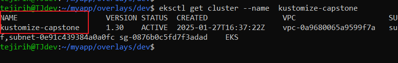

# Implementing a Multi-Environment Application Deployment with Kustomize

Deploying a web application in a Kubernetes environment often requires distinct configurations for development, staging, and production environments. This guide demonstrates how to use **Kustomize** for managing these configurations efficiently and integrating them into a CI/CD pipeline.


---

## Objective

To utilize **Kustomize** for efficient configuration management across multiple environments and integrate the deployment process into a **CI/CD pipeline**.

---

## Steps to Implement Multi-Environment Deployment

### Step 1: Set Up the Project Repository

1. Create a new project directory.
2. Organize the directory using **Kustomize** conventions:
   - A `base` directory for common configurations.
   - An `overlays` directory with subdirectories for each environment:
     - `dev/`
     - `staging/`
     - `prod/`


### Step 2: Initialize Git

In the root directory, initialize a **Git** repository:

```
git init
```
### Step 3 : Define Base Configuration
Inside the base directory:

1. Define Kubernetes resources like **deployment.yaml** and **service.yam**l for the application.
2. Create a kustomization.yaml file to include these resources:

```
apiVersion: kustomize.config.k8s.io/v1beta1
kind: Kustomization
resources:
  - deployment.yaml
  - service.yaml

configMapGenerator:
  - name: site-config
    literals:
      - SITE_NAME="My Static Website"

secretGenerator:
  - name: site-secret
    literals:
      - SECRET_KEY="super-secret-value"

```
### Step 4: Create Environment-Specific Overlays:
For each environment (dev/, staging/, prod/):

1. Create a kustomization.yaml file to customize the base configuration.
2. Add files like:
    - `deployment-patch.yaml` (to define replicas images, etc.)
    - `configmap.yaml`
    - `secret.yaml`
3. Reference these files in the **kustomization.yaml**.

Each environment will have variations in replica counts, images, and environment variables.

### Step 5: Creating the cluster
Before applying Kustomize configurations, ensure that the AWS EKS cluster is available.

For example, delete an old cluster and create a new one:

```
aws eks delete-cluster --name kustomize-capstone --region eu-north-1

```



### Step 6: Defining the script
1. Push the project to a GitHub repository.
2. Add a GitHub Actions workflow file (.github/workflows/deployment.yml) to trigger deployments on pushes or pull requests.
3. The workflow should:
    - Use `ubuntu-latest` as the runner.
    - Check out the repository. 
    - Log in to `Docker Hub`.
    - Build, tag, and push the Docker image.
    - Authenticate `AWS EKS`.
    - Deploy the application using Kustomize:

```
kubectl apply -k overlays/staging
```

### Step 6: Configure AWS and Docker Secrets
In GitHub Repository → Settings → Secrets, add the following credentials:

    - Docker Hub username & password
    - AWS Access Key ID
    - AWS Secret Access Key

These will be referenced in the workflow script


### Step 7: Test the Workflow
Once the script is committed and pushed to GitHub, the pipeline will trigger automatically.
Test deployments in different environments:

```
kubectl apply -k overlays/dev
kubectl apply -k overlays/staging
kubectl apply -k overlays/prod
```


### Challenges Encountered
Pipeline Failures:
The script initially failed due to directory path issues. This was resolved by adding commands to verify and navigate directories correctly.

### Conclusion
The project successfully deployed to AWS EKS with environment-specific configurations.


The deployment process was automated using GitHub Actions, ensuring that each environment had the appropriate configurations and image versions.


